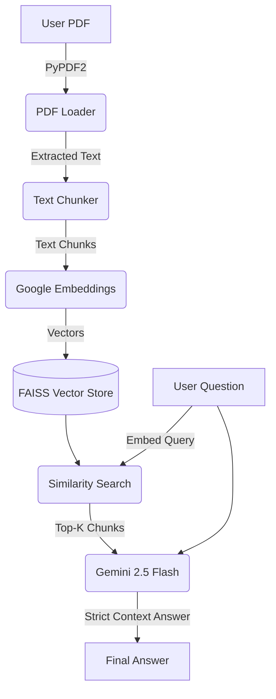

# Lightweight Document Question Answering (RAG) Pipeline

## Project Overview
This project is a production-ready, lightweight Document Question Answering (RAG) Pipeline built with Python. It allows users to process a PDF document, build a FAISS vector index using Google's free embedding models, and query the document using the Gemini 2.5 Flash model. The application runs entirely on CPU and is optimized for local usage without requiring expensive hardware or paid API services.

## Architecture Diagram


## Folder Structure
```
document_qa/
│
├── main.py
├── config.py
├── requirements.txt
├── README.md
├── .env.example
├── .gitignore
│
├── data/                  # Store your PDF here
├── vectorstore/           # Local FAISS index persistence
│
└── utils/
    ├── pdf_loader.py
    ├── text_chunker.py
    ├── embeddings.py
    ├── vector_store.py
    ├── retriever.py
    ├── llm.py
    ├── prompt.py
    └── logger.py
```

## Installation & Setup

1. **Clone or Extract the Project**
2. **Create a Virtual Environment**
   ```bash
   python -m venv venv
   source venv/bin/activate  # Linux/Mac
   venv\Scripts\activate   # Windows
   ```
3. **Install Dependencies**
   ```bash
   pip install -r requirements.txt
   ```
4. **API Key Setup**
   - Copy `.env.example` to `.env`.
   - Get your free API key from Google AI Studio.
   - Add it to the `.env` file: `GOOGLE_API_KEY=your_api_key_here`

## How to Run
Place your desired PDF in the `document_qa/` folder (or provide an absolute path), and run:

```bash
python main.py
```

## Sample Commands & Expected Output
```text
==================================
Lightweight Document QA
==================================
Enter PDF Path:
sample.pdf

Processing PDF...
Creating Embeddings...
Building FAISS Index...
Ready.

Ask a Question:
>> What is the leave policy?

Retrieved Chunks:
Chunk 1
Score: 0.91
...

Answer:
Employees are entitled to twelve casual leaves per year.
```

## Troubleshooting
- **Missing API Key**: Ensure `.env` is created and `GOOGLE_API_KEY` is valid.
- **Dependency Issues**: Make sure you are using Python 3.11+ and have activated the virtual environment.

## Future Improvements
- Add support for multiple PDFs in a single index.
- Implement web UI using Streamlit or Gradio.
- Include metadata filtering for complex queries.
